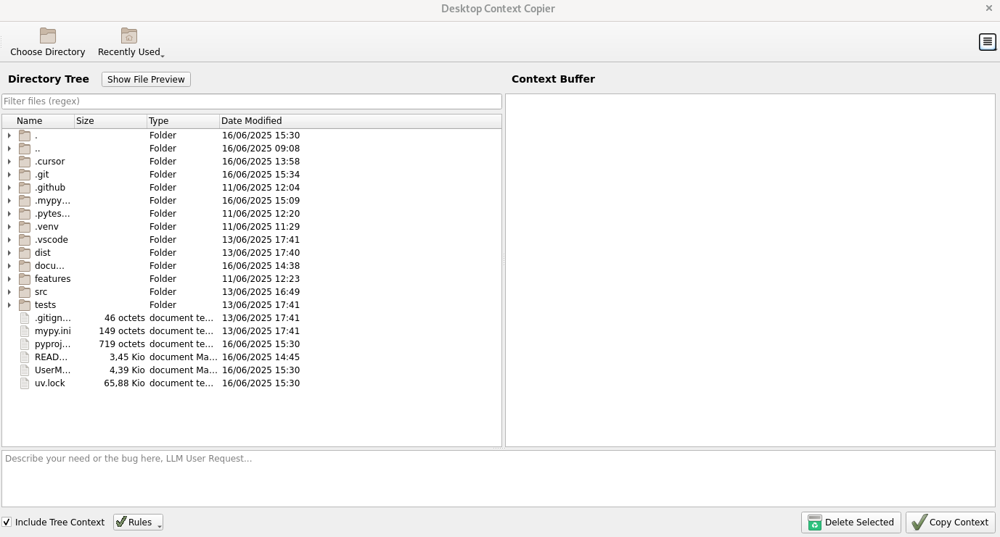

# Context to LLM

**Give your AI assistant the context it needs to help you effectively. Quickly copy repository structures, coding guidelines, or file contents to your clipboard, then paste them directly into your AI chat.**



🧠 **What It Does?**

LLM Context Tool helps developers quickly extract and share meaningful context from their codebase to ChatBots like ChatGPT, Claude, or Gemini.

🎯 **Why You Need It?**

ChatBots are only as smart as the context you give them.
This tool makes that easy by solving common pain points:
- Manually copying repo trees or files? 🐌 Slow.
- ChatBot not helping? 😫 Lacks rules, structure, or dependencies to make sense of your code.

✨ **Key Features**

📂 **Copy Repo Structure**
Give the model a clear picture of your project layout.
The file tree helps ChatBots understand your architecture, dependencies, and context — just like a human developer would.

📜 **Copy Project Rules (like Cursor Rules but you can have MANY)**
Extract guiding rules or architectural constraints that steer how the model should think.
Perfect for setting boundaries or nudging LLM behavior (naming conventions, folder usage, coding styles, etc.).

📄 **Copy File Chunks**
Select specific pieces of code — functions, components, tests — and share only what matters.
Ideal for focused debugging or feature walkthroughs.

📋 **Clipboard Ready**
Everything is formatted for easy pasting into ChatBots.
Clean, structured, and optimized for context-aware conversations.

🚀 **How does it work?**

1. Browse any directory from the **left panel** (tree view).
2. Drag‑and‑drop files into the **right panel** for context "buffering".
3. Hit **Copy Context** to send to the clipboard:
   * the filtered directory tree (tagged `<tree_structure>`), and
   * the full contents of every collected file (tagged by path).

More details in the [UserManual](./UserManual.md)

## Installation

# Use it
Available on pypi
https://pypi.org/project/codebase-to-llm/
```
uv run --with codebase-to-llm codebase-to-llm
```

To install uv, please refer to the official documentation https://docs.astral.sh/uv/guides/install-python/

# Make it evolve

## Clone the repo
```shell
git clone
```
## Configure venv
```shell
# Install dependencies with **uv**
uv venv --python 3.12
# Synchroniz Deps
uv sync
# Run the application
uv run ./src/codebase_to_llm/main.py
```

## VSCode Setup

To run and debug the application easily in VSCode:

1. Open the project folder in VSCode.
2. Ensure you have the Python extension installed.
3. Use the provided launch configuration:
   - Go to the Run & Debug panel (Ctrl+Shift+D).
   - Select "Run Desktop Context Copier" and press F5 to launch.

If you do not see the configuration, ensure `.vscode/launch.json` exists as below.

```json
{
    "version": "0.2.0",
    "configurations": [
        {
            "name": "Run Desktop Context Copier",
            "type": "python",
            "request": "launch",
            "program": "${workspaceFolder}/src/codebase_to_llm/main.py",
            "console": "integratedTerminal"
        }
    ]
}
```

## Architectural Principles in the Repo

* **Hexagonal Architecture** (Ports/Adapters) keeps the Infrastructure Layer replaceable.
* **DDD**: all important business rules (tree rendering) live in `domain/`.
* **Banishing Try/Except** Result type eliminates exceptions in domain & application layers.
* **Immutable code** — `@final`, `__slots__`, and pure functions.

## Testing

```shell
pytest -q
```

# Enjoy!
